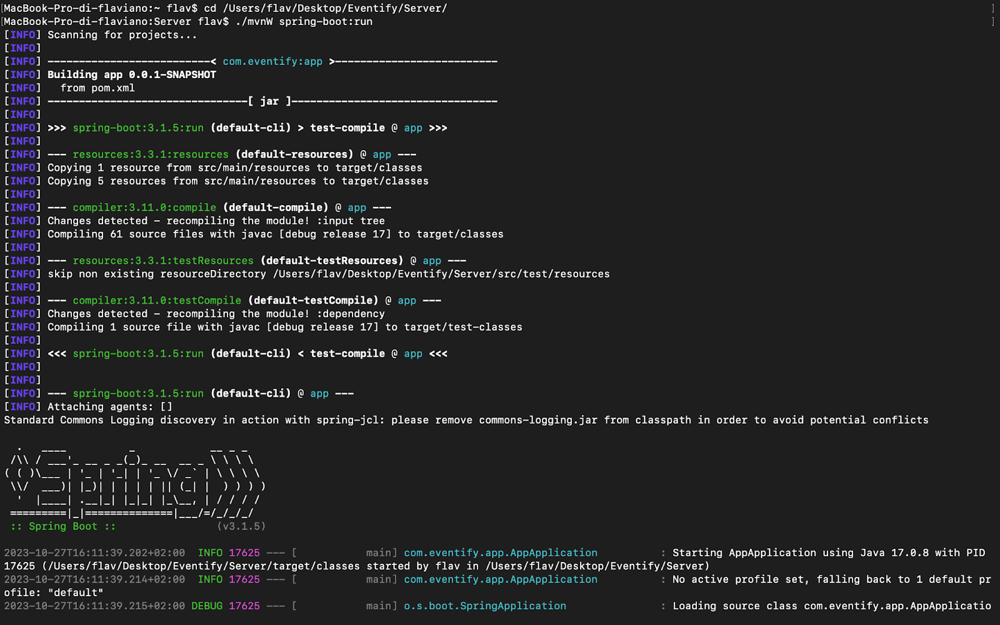

# Guida di Avvio dell'Applicazione Eventify

Benvenuti in Eventify, la piattaforma che connette le persone e offre esperienze uniche. Per iniziare, seguite questa guida passo dopo passo per avviare correttamente l'applicazione Eventify sul vostro sistema.

## Requisiti di Sistema

Prima di iniziare, assicuratevi di soddisfare i seguenti requisiti di sistema:

- **Database PostgreSQL**: Dovete avere un'istanza funzionante di PostgreSQL con le credenziali di accesso correttamente configurate. Assicuratevi che il database sia attivo e pronto a ricevere connessioni.

- **Java Development Kit (JDK)**: L'applicazione backend è basata su Java. Assicuratevi di avere installato un JDK compatibile con la versione di Java utilizzata nell'applicazione, Java 17 in questo caso.

- **Node.js e Node Package Manager (NPM)**: Il frontend dell'applicazione è basato su Angular. Assicuratevi di avere Node.js e npm installati sul vostro sistema.

## 1° STEP: Avvio del Database PostgreSQL

Prima di avviare l'applicazione, assicuratevi che il database PostgreSQL sia in esecuzione. Seguite questi passi:

1. Assicuratevi di aver configurato correttamente il database con le credenziali di accesso necessarie e che l'istanza del database sia pronta per accettare connessioni.
La parte di configurazione si trova in Server/src/main/application.properties
del progetto :

3. La parte di configurazione del database si trova in `Server/src/main/application.properties` del progetto. Verificate che le credenziali siano corrette.

4. L'applicazione utilizza un file `schema.sql` per creare uno schema denominato "Eventify" nel database PostgreSQL se non esiste già. Assicuratevi che questo file sia presente e contenga la clausola `create schema if not exist`.

## 2° STEP: Avvio del Server Backend

Una volta che il database PostgreSQL è operativo, è possibile avviare il server backend dell'applicazione. Seguite questi passi:

1. Aprire una finestra del terminale.

2. Navigare nella cartella Server utilizzando il comando:
   ```bash cd /percorso/cartella/Server ```
3. Eseguire il seguente comando per avviare il server Spring Boot:
```bash ./mvnw spring-boot:run ```
4. Dovresti ottenere il seguente output:

## 3° STEP: Avvio del Frontend

Dopo aver avviato con successo il server backend, è ora necessario avviare il frontend dell'applicazione. Ecco come farlo:

1. Aprire una finestra del terminale.

2. Navigare nella cartella Client utilizzando il comando:
   ```bash
   cd /percorso/cartella/Client
   ```

3. Eseguire i seguenti comandi per installare le dipendenze e avviare Angular:
   ```bash
   npm install
   ng serve
   ```
4. Dovresti ottenere il seguente output:
   
   
## 4° STEP: Avvio dell'Applicazione

Una volta che il server backend e il frontend sono avviati con successo, è possibile accedere all'applicazione tramite un browser web. Seguite questi passi:

1. Aprire il browser preferito.

2. Accedere all'indirizzo:
   ```plaintext
   https://localhost:4200

3. Ti si aprirà questa pagina web, poichè il certificato è self-signed
e l’applicazione è hostata in locale.

Dovrai cliccare Avanzate e poi cliccare su Procedi su localhost.


# BENVENUTI IN <span style="color:#FF6700">EVENTIFY</span>

L'applicazione è ora pronta per l'uso e sarà possibile sfruttarne tutte le funzionalità in modo sicuro e affidabile.


